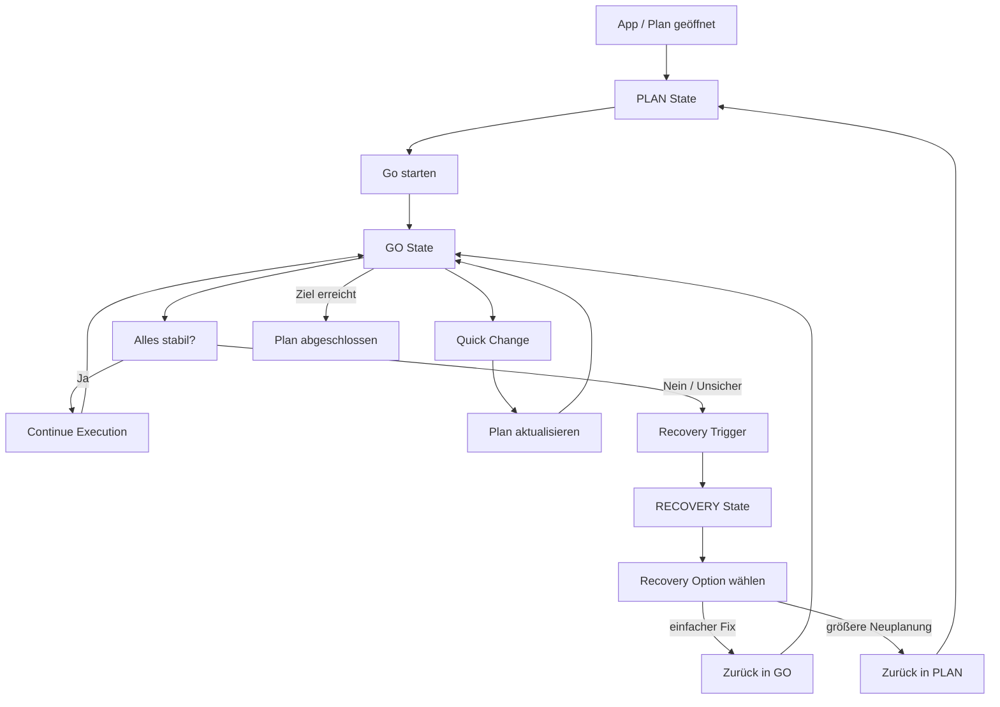

# CatchIt – State Flow (Plan → Go → Recovery)

## Kurzlogik

- **PLAN**: Planung läuft horizontal. Nutzer erstellt oder bearbeitet eine Kette.
- **GO**: Ausführung läuft vertikal. Fokus liegt auf dem aktuellen Schritt und der nächsten Entscheidung.
- **RECOVERY**: Wird ausgelöst, wenn die Lage instabil wird, etwa bei Verzug, verpasstem Anschluss oder Kontextwechsel.
- **Quick Change**: Kleine Anpassung innerhalb von GO, ohne komplette Rückkehr in PLAN.
- **Neuplanung**: Größere Abweichungen führen zurück in PLAN.