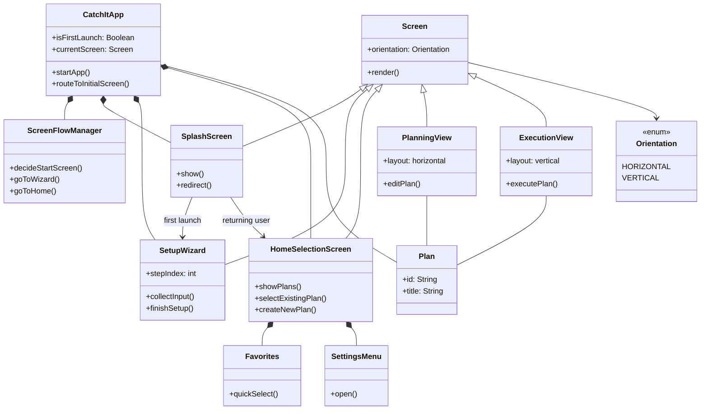

# CatchIt – UML-Klassendiagramm

```mermaid
classDiagram
direction TB

class CatchItApp {
  +isFirstLaunch: Boolean
  +currentScreen: Screen
  +startApp()
  +routeToInitialScreen()
}

class ScreenFlowManager {
  +decideStartScreen()
  +goToWizard()
  +goToHome()
}

class Screen {
  +orientation: Orientation
  +render()
}

class SplashScreen {
  +show()
  +redirect()
}

class SetupWizard {
  +stepIndex: int
  +collectInput()
  +finishSetup()
}

class HomeSelectionScreen {
  +showPlans()
  +selectExistingPlan()
  +createNewPlan()
}

class Favorites {
  +quickSelect()
}

class SettingsMenu {
  +open()
}

class Plan {
  +id: String
  +title: String
}

class PlanningView {
  +layout: horizontal
  +editPlan()
}

class ExecutionView {
  +layout: vertical
  +executePlan()
}

class Orientation {
  <<enum>>
  HORIZONTAL
  VERTICAL
}

CatchItApp *-- ScreenFlowManager
CatchItApp *-- SplashScreen
CatchItApp *-- SetupWizard
CatchItApp *-- HomeSelectionScreen

Screen <|-- SplashScreen
Screen <|-- SetupWizard
Screen <|-- HomeSelectionScreen
Screen <|-- PlanningView
Screen <|-- ExecutionView

HomeSelectionScreen *-- Favorites
HomeSelectionScreen *-- SettingsMenu

CatchItApp -- Plan
PlanningView -- Plan
ExecutionView -- Plan

Screen --> Orientation

SplashScreen --> SetupWizard : first launch
SplashScreen --> HomeSelectionScreen : returning user
```