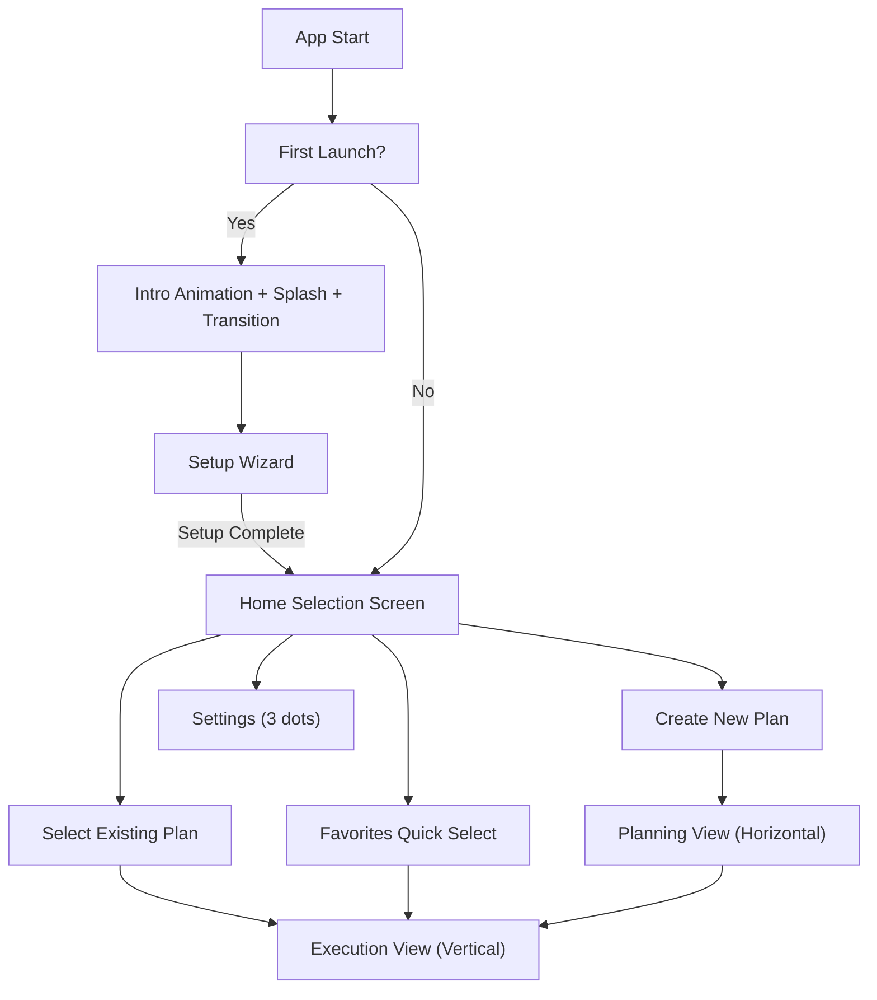

# CatchIt – User Flow (Onboarding + Nutzung)

```mermaid
graph TD
  A["App Start"]
  B["First Launch?"]
  C["Intro Animation + Splash + Transition"]
  D["Setup Wizard"]
  E["Home Selection Screen"]

  F["Select Existing Plan"]
  G["Create New Plan"]
  H["Planning View (Horizontal)"]
  I["Execution View (Vertical)"]

  J["Favorites Quick Select"]
  K["Settings (3 dots)"]

  A --> B

  B -- "Yes" --> C
  C --> D
  D -- "Setup Complete" --> E

  B -- "No" --> E

  E --> F
  E --> G
  E --> J
  E --> K

  F --> I
  J --> I

  G --> H
  H --> I
```